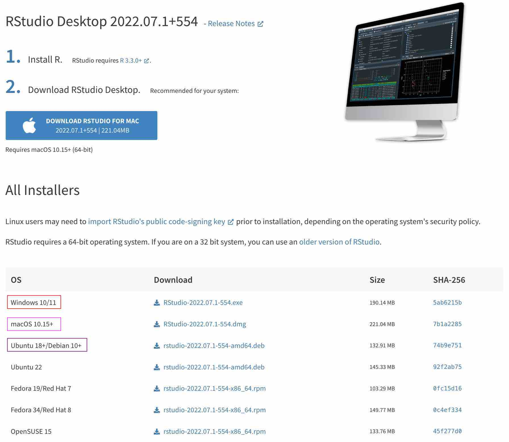
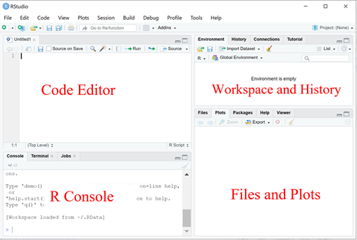
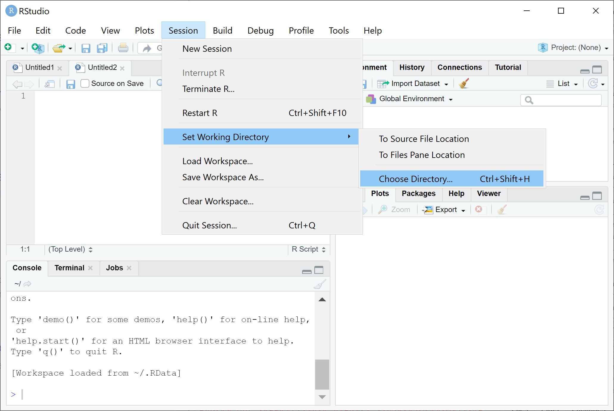

(ref:appendixsepart) Appendix

```{r echo=FALSE, results="asis", purl=FALSE}
cat("# (PART) Appendix {-} ")
```

# Appendix A: Install R & RStudio {#install - }

This manual covers the installation of both R and RStudio for three different 
operating systems: Windows, macOS and Ubuntu. You only need to follow the one 
that you are using on your computer.

**Difference between R and RStudio**

* R is the backbone of R programming. Once R is installed, you can use it 
  via its build-in `R Console` (self-contained), terminal or any third-party
  integrated development environment (IDE), e.g., RStudio.
  
* RStudio is a multi-facet and user-friendly IDE that can make R programming and 
  data analysis in one place and easy to manage. We recommend using RStudio 
  and only demonstrate with it, while you are free to use any other alternative.

**Acknowledgements**
This manual is adapted and updated from the 
[materials](https://holab-hku.github.io/R-workshop/prerequisite.html) produced 
by Xiunan Fang and other team members in Dr Joshua Ho's lab.


## A.1 Install R {-}

### R on Windows {-}
- Open an internet browser and go to https://cran.r-project.org/.
- Click on the ``Download R for Windows`` link at the top of the page.
- Choose the ``base`` and then Click on the ``Download R 4.2.1 for Windows``
  link at the top of the page (or a new version if this manual is outdated).
- Once the download is finished, you will obtain a file named 
  ``R-4.2.1-win.exe`` or similar depending on the version that you download.
- Most of the time, you will likely want to go with the defaults, so click the 
  button ``Next`` until the process is complete.

### R on macOS {-}
- Open an internet browser and go to https://cran.r-project.org/.
- Click on the ``Download R for macOS`` link at the top of the page.
- Click on the file containing the latest version of R under the 
  **Latest release**.
- Save the ``.pkg`` file, double-click it to open, and follow the installation 
  instructions. 
  **Note**, there are two versions of the .pkg installation file according to 
  the CPU model: Intel Macs (Intel-based) or M1 Macs (ARM-based). 
  **Please choose accordingly**.

### R on Ubuntu {-}

As it is common, prior to installing R, let us update the system package index 
and upgrade all our installed packages using the following two commands:
```
sudo apt update
sudo apt -y upgrade
```

After that, all that you have to do is run the following in the command line to 
install base R.
```
sudo apt -y install r-base
```


## A.2 Install RStudio {-}

Now that R is installed, you need to download and install RStudio.
It is more straightforward to install RStudio and very similar across the three 
OS. 

- Go to https://www.rstudio.com/products/rstudio/download/#download. We are 
  using ```RStudio Desktop`` **Free** version.
- Click on the right file for your OS (e.g., `.exe` file for Windows)
- The installation process is very straightforward as the figure below.

{width=65%}


## A.3 Use R inside RStudio {-}
### R studio {-}
RStudio is very powerful for providing a four-pane workspace.

* Top-left panel: Your scripts of the R codes, script is good to keep a record 
  of your work and also convenient for command execution.

  You can create a new script by `` File –> New –> R Script``

* Bottom-left panel: R console for R commands, where you actually run the R 
  codes.

* Top-right panel: Workspace tab: All the data(more specifically, R objects) 
  you have created in the ``Workspace`` and all previous commands you 
  previously ran in the ``History``.

* Bottom-right panel: Files in your working directory(you probably should also 
  set your working directory) in ``Files``, and the plots you have created in 
  ``Plots``.

{width=65%}

### Set working directory {-}
-  Create a folder named “biof_Rdir” in your preferred directory
-  Create a "data" folder in the "biof_Rdir"
-  From RStudio, use the menu to change your working directory under
``Session > Set Working Directory > Choose Directory``
-  Choose the directory to “biof_Rdir”

{width=65%}

Or you can type in the console:
```
setwd("/yourdirectory/biof_Rdir")
```
For Windows, the command might look like :
```
setwd("c:/yourdirectory/biof_Rdir")
```

### Some general knowledge {-}
- R is case-sensitive
- Type enter to run R code in the console pane
- Ctrl-enter or Cmd-return if the code is in the scripts pane.
- Comments come after # will not be treated as codes
- R has some pre-loaded data sets, to see the list of pre-loaded data, type 
  ``data()``
- In R, a function is an object, a basic syntax of an R function looks like 
  something below:
```
function_name <- function(arg_1, arg_2, ...) {
   actual function codes
}
```

For example:
```{r}
my_average <- function(x){
  sum(x)/length(x)
}

my_average(c(1, 4, 5, 7))
```

R contains a lot of built-in functions, you can use ``?`` to see the 
documentation of a function, there are also a lot of external libraries with 
specific functions. To use a library, we do:
```
install.packages('package_name')
library(package_name)
```

### Install packages {-}
There are several packages used in this workshop, in the R console, type:
```
install.packages('ggplot2')
install.packages('pheatmap')
install.packages('aod')
```

## A4. Cloud computing {-}
In case you have limited computing power, you can still use cloud computing to 
finish this course. There can be multiple options and here we mainly recommend
RStudio cloud (https://rstudio.cloud). You can explore directly from their 
website.


